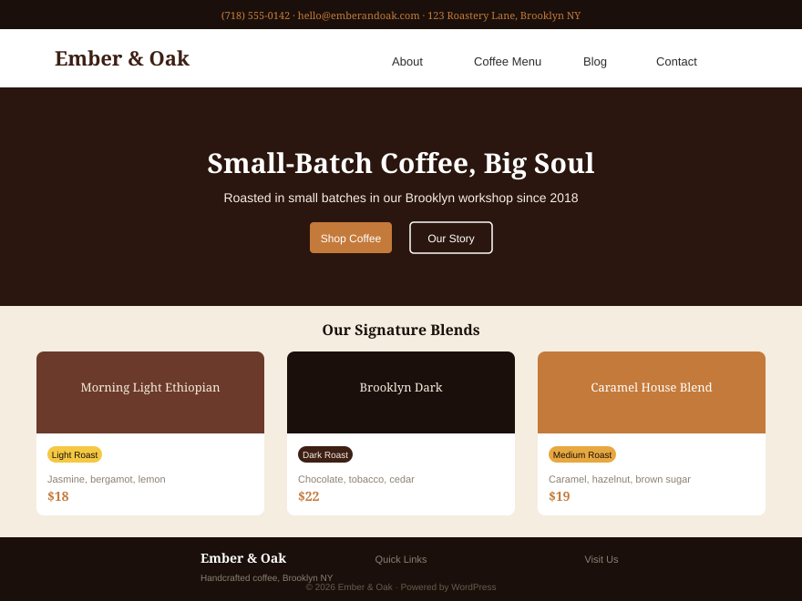

# Ember & Oak

  

A warm, artisan WordPress theme for **Ember & Oak Coffee Roasters** — a fictional small-batch coffee roastery and café based in Brooklyn, NY. Built from scratch using [Claude Code](https://claude.ai/code) as the primary development environment.



---

## Features

- **Custom Post Types** — Coffee Blends with roast level, tasting notes, origin, process, and pricing; Events with date, time, location, and capacity
- **Theme Customizer** — Hero text, contact info, hours, and social links — all editable without code
- **Full Template Hierarchy** — Dedicated templates for blend catalog, blend detail, events archive, event detail, blog, about, menu, and contact
- **Block Editor Ready** — `theme.json` exposes the full color palette, typography scale, and layout settings to the block editor
- **Accessible Navigation** — ARIA landmarks, keyboard-navigable dropdowns (`aria-expanded`), skip-to-content link, focus-visible outlines
- **Responsive Design** — Mobile-first CSS Grid/Flexbox, fluid typography with `clamp()`, tested from 375px to 1440px
- **Zero Build Step** — Plain CSS custom properties, vanilla JavaScript — no npm, no Webpack, no build process
- **Demo Content** — WXR import file with 4 coffee blends, 2 events, 3 blog posts, and 4 pages ready to import

---

## Requirements

- WordPress 6.0+
- PHP 8.0+
- No required plugins

---

## Installation

### Option 1 — Manual Upload

1. Download or clone this repository
2. Upload the `ember-oak` folder to `/wp-content/themes/`
3. In WP Admin, go to **Appearance → Themes** and activate **Ember & Oak**
4. Flush permalinks: **Settings → Permalinks → Save Changes**

### Option 2 — WP-CLI

```bash
wp theme install https://github.com/Norie017/ember-oak/archive/refs/heads/master.zip
wp theme activate ember-oak
wp rewrite flush
```

### Option 3 — Git (into themes directory)

```bash
cd /path/to/wp-content/themes
git clone https://github.com/Norie017/ember-oak.git
wp theme activate ember-oak
wp rewrite flush
```

---

## Demo Content

Import the included `demo-content.xml` to see the theme as intended:

1. Install the WordPress Importer plugin:
   ```bash
   wp plugin install wordpress-importer --activate
   ```
2. Go to **Tools → Import → WordPress**
3. Upload `demo-content.xml` from the theme root
4. Map authors to an existing user (or create new)
5. Check **Download and import file attachments** if desired
6. After import, set the **Home** page as your static front page:
   **Settings → Reading → A static page → Front page: Home**

---

## Customization

### Theme Customizer

Navigate to **Appearance → Customize → Ember & Oak Settings**:

| Panel | Setting | Description |
|-------|---------|-------------|
| Hero Section | Hero Heading | Main homepage headline |
| Hero Section | Hero Subheading | Subtitle text below headline |
| Hero Section | CTA Button Text | Homepage call-to-action label |
| Hero Section | CTA Button URL | Homepage call-to-action destination |
| Contact Info | Phone | Shown in header bar and footer |
| Contact Info | Email | Shown in footer and used for RSVP links |
| Contact Info | Address | Shown in footer Visit Us column |
| Contact Info | Weekday Hours | Mon–Fri opening hours |
| Contact Info | Weekend Hours | Sat–Sun opening hours |
| Social Links | Instagram URL | Footer social icon link |
| Social Links | Facebook URL | Footer social icon link |
| Social Links | Twitter URL | Footer social icon link |

### Navigation Menus

Assign menus at **Appearance → Menus**:
- **Primary Menu** — Main site navigation (desktop + mobile)
- **Footer Menu** — Links in footer Quick Links column
- **Social Links** — Optional social icon menu

---

## Custom Post Types

### Coffee Blends (`/blends/`)

Create and manage blends under **Coffee Blends** in the admin sidebar. Each blend has a **Blend Details** metabox with:

| Field | Description |
|-------|-------------|
| Roast Level | Light / Medium / Dark / Espresso |
| Tasting Notes | Free-text flavor description |
| Origin Region | Country/region of origin |
| Process | Washed / Natural / Honey |
| Price | Numeric price (USD) |
| Weight Options | Checkboxes: 250g / 500g / 1kg |

Assign **Origin** taxonomy terms for filterable browsing at `/origin/[term]/`.

### Events (`/events/`)

Create events under **Events** in the admin sidebar. Each event has an **Event Details** metabox:

| Field | Description |
|-------|-------------|
| Event Date | YYYY-MM-DD format |
| Event Time | Human-readable time (e.g. "6:00 PM") |
| Location | Venue name and address |
| Price | Ticket price or "Free" |
| Capacity | Maximum number of attendees |

---

## Page Templates

Assign page templates via the **Page Attributes** panel when editing a page:

| Template | Description |
|----------|-------------|
| **About Us** | Story, mission, team grid, values, press logos |
| **Coffee Menu** | JS-filtered blend catalog pulling from the `ember_blend` CPT |
| **Contact** | Contact form, info from customizer, hours table, FAQ accordion |

---

## File Structure

```
ember-oak/
├── style.css                # Theme header + CSS reset + base styles + utilities
├── theme.json               # Block editor palette, typography, and layout settings
├── functions.php            # Theme setup, CPTs, taxonomies, meta boxes, customizer, helpers
├── index.php                # Blog index fallback
├── front-page.php           # Homepage template
├── page.php                 # Default page template
├── single.php               # Single post/CPT router
├── archive.php              # Archive router (blends, events, blog)
├── search.php               # Search results
├── 404.php                  # Not found
├── header.php               # Sticky header with accessible nav
├── footer.php               # 4-column footer
├── sidebar.php              # Blog sidebar
├── template-parts/
│   ├── content.php          # Blog post card
│   ├── content-none.php     # Empty state
│   ├── content-blend.php    # Single blend detail
│   └── content-event.php    # Single event detail
├── templates/
│   ├── page-about.php       # About Us page template
│   ├── page-menu.php        # Coffee Menu page template
│   └── page-contact.php     # Contact page template
├── assets/
│   ├── css/main.css         # All component styles
│   └── js/main.js           # Vanilla JS interactions
├── demo-content.xml         # WXR import file
├── screenshot.svg           # Theme preview
├── CLAUDE.md                # Development narrative and architecture notes
└── README.md                # This file
```

---

## Built With Claude Code

This theme was built from scratch using Claude Code as the sole development environment — see [CLAUDE.md](CLAUDE.md) for the full development narrative including architecture decisions, workflow patterns, and how the Workflow tool was used to parallelize file generation.

---

## License

[GPL-2.0-or-later](https://www.gnu.org/licenses/gpl-2.0.html)
